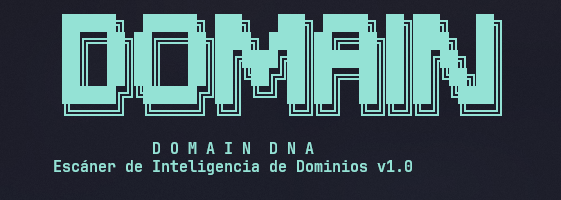
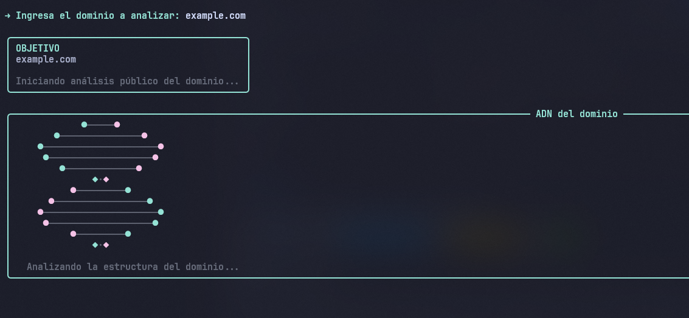
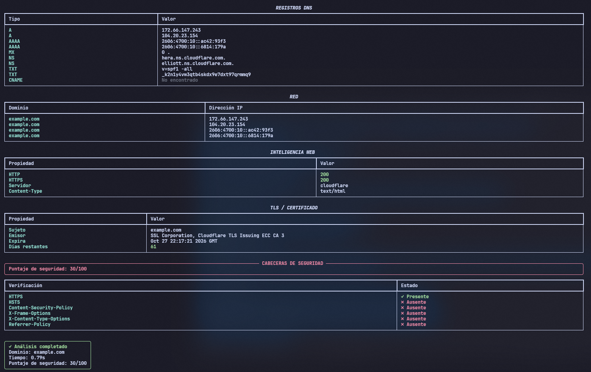

<div align="center">



### 🧬 Escáner de Inteligencia de Dominios OSINT


</div>

## 📖 Descripción

**DomainDNA** es una herramienta de reconocimiento de dominios que mapea toda la "información genética" pública de un sitio web: sus registros DNS, su comportamiento web, su certificado TLS y sus cabeceras de seguridad.

🧬 Todo el análisis se muestra en tablas claras y coloreadas en la terminal, acompañado de una animación de una **doble hélice de ADN** que gira mientras el escaneo corre en segundo plano.

El escaneo combina peticiones asíncronas (DNS + HTTP/HTTPS en paralelo) con una verificación TLS directa por socket, así que los resultados llegan rápido incluso analizando varios aspectos del dominio a la vez.

> ⚠️ **Uso responsable:** DomainDNA solo consulta información pública (DNS, cabeceras HTTP y el certificado TLS expuesto por el propio servidor). No explota vulnerabilidades ni realiza ningún tipo de intrusión.

## ✨ Características

|     |                                                                          |
| --- | ------------------------------------------------------------------------ |
| 🌐  | Resolución de registros DNS (A, AAAA, MX, NS, TXT, CNAME)                |
| 🕵️  | Inteligencia web: estado HTTP/HTTPS, servidor y Content-Type             |
| 🔐  | Lectura del certificado TLS (sujeto, emisor, expiración, días restantes) |
| 🛡️  | Puntaje de seguridad basado en cabeceras (HSTS, CSP, X-Frame-Options...) |
| ⚡  | Escaneo DNS + Web en paralelo con `asyncio` para resultados más rápidos  |
| 🧬  | Animación propia de doble hélice de ADN, en loop, mientras se analiza    |
| 📦  | Exportación de resultados a JSON con una sola confirmación (S/N)         |
| 🎨  | Interfaz de terminal completamente en español, coloreada con `rich`     |

## 🖼️ Capturas

**Animación de análisis**



**Resultado de un análisis**



## ⚙️ Instalación

```
git clone https://github.com/Spyk3r/DomainDNA.git
cd DomainDNA
pip install -r requirements.txt
```

### Requisitos

- 🐍 Python 3.9 o superior
- 📦 Las dependencias listadas en `requirements.txt`:
  - `rich`
  - `httpx`
  - `dnspython`

## 🚀 Uso

```
python3 domaindna.py
```

En Windows:

```
python domaindna.py
```

Al iniciar verás el banner de bienvenida y se te pedirá el dominio a analizar:

1. 🧬 Ingresa el dominio (por ejemplo `example.com`).
2. 🔄 DomainDNA lanza el escaneo DNS, web y TLS en paralelo, mostrando la animación de la doble hélice mientras trabaja.
3. 📊 Al terminar, se imprimen las tablas de resultados: DNS, red, web, TLS y cabeceras de seguridad.
4. 💾 Al final se pregunta `¿Exportar resultados a JSON? (s/N)`, donde puedes responder `s` / `n` (o dejarlo vacío para usar el valor por defecto).

## 🧠 Información que recolecta

**🌐 DNS**

- Registros A / AAAA (direcciones IPv4 e IPv6)
- Registros MX (servidores de correo)
- Registros NS (servidores de nombres)
- Registros TXT y CNAME

**🕵️ Web**

- Código de estado HTTP y HTTPS
- Cabecera `Server` y `Content-Type`
- Cabeceras de seguridad presentes: HSTS, CSP, X-Frame-Options, X-Content-Type-Options, Referrer-Policy

**🔐 TLS / Certificado**

- Sujeto (Common Name) e issuer del certificado
- Fecha de expiración y días restantes

**🛡️ Puntaje de seguridad**

- Puntaje de 0 a 100 calculado a partir de HTTPS activo y las cabeceras de seguridad presentes

## 🧪 Compatibilidad

- ✅ Windows 10 / 11 (Windows Terminal / PowerShell)
- ✅ Linux (cualquier distro con Python 3.9+)
- ✅ macOS
- ✅ Termux (Android)

> La animación de ADN y los colores requieren una terminal con soporte UTF-8. Si tu terminal no muestra bien algunos caracteres, prueba con Windows Terminal, iTerm2 o cualquier terminal moderna.

## 👤 Créditos

|                   |                                                 |
| ------------------ | ----------------------------------------------- |
| 🧑‍💻 **Creador**    | Spyk3r                                          |
| 🐙 **GitHub**       | [github.com/Spyk3r](https://github.com/Spyk3r)  |

<div align="center">

Hecho con 🖤 por **Spyk3r**

</div>
